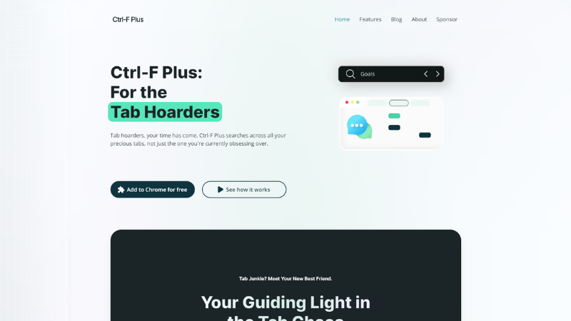

# Ctrl-F.Plus

<div align="center">
  
</div>


## Technologies
This application requires Node.js v18.15+.
- **Framework**: [Next.js](https://nextjs.org/)
- **Styling**: [Tailwind CSS](https://tailwindcss.com)
- **Animation**: [Framer Motion](https://www.framer.com/motion/)
- **Static Content**: [MDX](https://mdxjs.com/) & [Content Layer](https://contentlayer.dev/)


## Getting Started

First, install the npm dependencies:
```bash
pnpm install
```

Next, create a new `.env` file by copying [`.env.example`](.env.example):
```bash
cp .env.example .env.local
```

Next, run the development server:

```bash
pnpm dev
```

Finally, open [http://localhost:3000](http://localhost:3000) in your browser to view the website.


## Scripts:
- `pnpm dev`
  - Runs the development server

- `pnpm run dev:clear-cache`
  - Rebuilds the `.next` and `.contentlayer` folders before running the development server. This is required in order to see styling changes when editing the blog markdown file: `ctrl-markdown-theme.json`.

- `pnpm run build`
  - Creates a production build

- `pnpm run start`
  - Runs a local copy of the production build on [http://localhost:3000](http://localhost:3000)
- `pnpm run lint`
  - Checks styling throughout codebase
